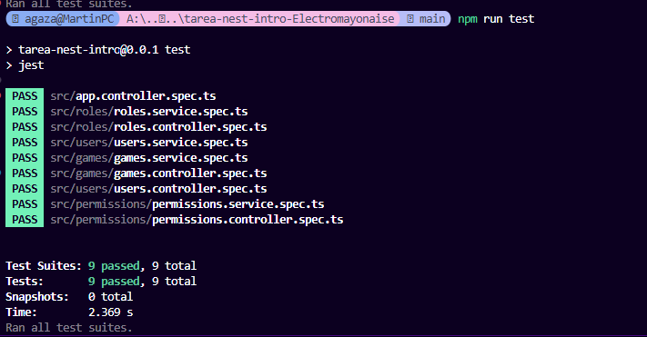
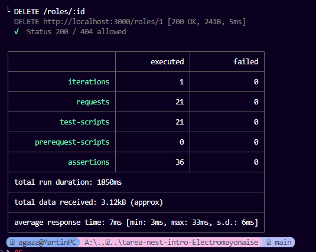

# Nest Intro – Instrucciones de ejecución

## Requisitos
- **Node.js** ≥ 18
- **Docker & Docker Compose**
- **npm** (incluye `npx`)

### Variables de entorno

Por facilidad se incluye un archivo `.env` con las variables de entorno necesarias para la conexión a la base de datos y el puerto del servidor.

---

## 1) Levantar la base de datos en contenedor
En la raíz del proyecto:
```bash
docker compose up -d
```

Verifica que Postgres está arriba:
```bash
docker ps
```

---

## 2) Instalar dependencias y ejecutar la app (Node)
```bash
npm install
npm run build
npm run start:dev   # modo desarrollo
# Alternativa:
# npm run start
```

Probar endpoint de salud:
```bash
curl http://localhost:3000/
# Hello World!
```

---

## 3) Ejecutar pruebas con Jest
```bash
npm run tests 
```

### Resultados esperados


---

## 4) Probar endpoints con Postman + Newman

### 4.1 Instalar Newman y el reporter HTML
```bash
npm i -g newman
npm i -g newman-reporter-html
```

### 4.2 Ejecutar la colección
Archivo: `nest-intro-postman.collection.json`

```powershell
newman run ".\nest-intro-postman.collection.json" --reporters "cli,html" --reporter-html-export ".\newman-report.html"
```


### Resultados esperados

